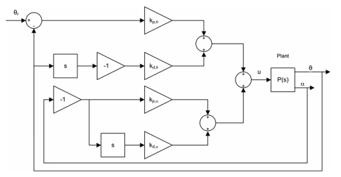

# Lab 8 Section 1
In this section we will explore the pendulum attachment for the Qube-Servo 3 with the goal of balancing the arm.

---

## Part 1 - Important Varibles/Equations
To successfully balance the pendulum, we first need to understand the data the Qube-Servo 3 provides and how that data is used to calculate the motor's response. 

### State Variables
To maintain the upright position of the pendulum (the "Inverted Pendulum" problem), the system monitors four distinct variables. These variables represent the state of the system at any given moment. As seen in the last Lab, the Qube-Servo 3 uses two encoders to track position and then the python script calculates their rate of change (velocity).

| Variable | Symbol | Description | Units |
| :--- | :--- | :--- | :--- |
| **Motor Angle** | $\theta$ | The horizontal angle of the DC motor base. | Radians (rad) |
| **Pendulum Angle** | $\alpha$ | The vertical angle of the pendulum arm. | Radians (rad) |
| **Motor Velocity** | $\dot{\theta}$ | The speed at which the motor base is rotating. | rad/s |
| **Pendulum Velocity** | $\dot{\alpha}$ | The speed at which the pendulum is falling or swinging. | rad/s |

### Control (PD Control)
The goal of our controller is to output a specific **Voltage ($u$)** to the motor to keep the pendulum balanced at a desired motor position ($\theta_r$). 

We use a form of Full-State Feedback, which essentially combines Proportional (P) and Derivative (D) control for both the motor and the arm. The equation is as follows:

$$u = k_{p,\theta}(\theta_r - \theta) - k_{p,\alpha}\alpha - k_{d,\theta}\dot{\theta} - k_{d,\alpha}\dot{\alpha}$$

### Breaking down the Equation:
* **$u$**: The control output (Voltage) sent to the Qube-Servo 3.
* **$k_{p,\theta}(\theta_r - \theta)$**: The **Motor Position** term. It tries to move the motor to the reference angle $\theta_r$ defined in the code.
* **$-k_{p,\alpha}\alpha$**: The **Pendulum Position** term. This is the "balance" force; it reacts to the pendulum leaning away from the upright 0 position.
* **$-k_{d,\theta}\dot{\theta}$ and $-k_{d,\alpha}\dot{\alpha}$**: The **Damping** terms. These act like "brakes" to ensure the motor and pendulum don't oscillate wildly.

By tuning the gains ($k$), we can decide how aggressively the motor reacts to the pendulum falling versus how much it cares about its own base position.

## Part 2 - How Do We Find $d/dt$?

In your previous control courses, you likely treated position and velocity as smooth, continuous signals. However, the Qube-Servo 3 is a digital system. It doesn't "see" a continuous flow of movement; instead, it captures "snapshots" or **samples** of the encoder positions at a specific interval ($T_s$). 

### 1. The Challenge of Sampled Data
Because our data is non-continuous, we can't use a standard calculus derivative. Your first instinct might be to use a simple "rise over run" calculation: 

$$\text{Velocity} \approx \frac{\text{Position}_{\text{now}} - \text{Position}_{\text{last}}}{\text{Time Step}}$$

While this works in theory, in practice, it is incredibly **noisy**. Every tiny vibration or digital flicker in the encoder creates massive, jagged spikes in velocity. If we fed that noisy signal directly into our motor, the hardware would vibrate violently and potentially sustain damage.

### 2. A Familiar Transfer Function
To solve this, we use a **Filtered Derivative**. This should look very familiar to the continuous-time transfer functions you have been studying in your feedback control lectures:

$$H(s) = \frac{As}{s + A}$$

In this equation:
* The **$s$** in the numerator acts as the differentiator (the $d/dt$).
* The **$\frac{A}{s+A}$** acts as a **Low-Pass Filter** with a bandwidth of $A$ rad/s.

This setup allows us to calculate the velocity while simultaneously "smoothing out" the high-frequency noise that comes with digital sampling.

### 3. The `ddt_filter` Function
In the provided Python script, you will see a function called `ddt_filter`. 

You don't need to worry about the internal algebra of this function for this lab. Just know that it takes the "chunky," non-continuous position data and converts it into a clean, usable velocity signal ($\dot{\theta}$ or $\dot{\alpha}$) that the controller can use to balance the arm.

> **Courious about the ddt_filter function?** If you are interested in how we transform a continuous $s$-domain equation into digital friendly one using techniques like the **Tustin Transform**, I highly recommend taking the **DSP (Digital Signal Processing)** course offered here at the university!

## Part 3 - Run the Python Script 
Run the python script in this module and answer the following questions in a word doc (Please export to **PDF** before turing in). 

### Q1 - 

### Q2 - 

### Q3 - 

---

## Resources
* [Resource Link 1]
