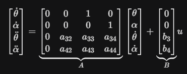

# Mathematical Modeling of a Rotary (Furuta) Pendulum

Now that we have constructed a functioning rotary pendulum, let's once again go over the theory behind it.

## 1. Variable Identification
To model the system, we define the following physical constants:

* **m_p**: Mass of the pendulum (kg)
* **L_r**: Length of the rotary arm (m)
* **l_p**: Distance from the pendulum pivot to its center of mass (m)
* **J_r**: Moment of inertia of the rotary arm (kg·m²)
* **J_p**: Moment of inertia of the pendulum (kg·m²)
* **g**: Gravitational constant (9.81 m/s²)
* **tau**: Torque applied by the motor (N·m), which is later converted into voltage applied by the motor

**States:**
* **theta**: Rotary arm angle
* **alpha**: Pendulum angle (0 at the upright vertical position)

---

## 2. Deriving Non-Linear Equations (Euler-Lagrange)
We find the equations of motion by defining the Lagrangian $L = T - V$, where $T$ is Kinetic Energy and $V$ is Potential Energy.

### Kinetic Energy (T)
$T = T_{arm} + T_{pendulum}$
* The arm rotates in a horizontal plane.
* The pendulum rotates in a vertical plane relative to the arm.

### Potential Energy (V)
$V = m_p g l_p \cos(\alpha)$

### The Euler-Lagrange Equation
For each coordinate $q \in \{\theta, \alpha\}$:
$\frac{d}{dt}(\frac{\partial L}{\partial \dot{q}}) - \frac{\partial L}{\partial q} = Q_i$

**Resulting Non-Linear Equations:**
1. $(J_r + m_p L_r^2) \ddot{\theta} + (m_p L_r l_p \cos(\alpha)) \ddot{\alpha} - (m_p L_r l_p \sin(\alpha)) \dot{\alpha}^2 = \tau$
2. $(m_p L_r l_p \cos(\alpha)) \ddot{\theta} + (J_p + m_p l_p^2) \ddot{\alpha} - m_p g l_p \sin(\alpha) = 0$

---

## 3. Linearization
We linearize around the unstable equilibrium (upright position), where $\alpha$ is approximately 0 and velocities are small.

**Small Angle Approximations:**
* $\cos(\alpha) \approx 1$
* $\sin(\alpha) \approx \alpha$
* $\dot{\alpha}^2 \approx 0$ (ignoring higher-order terms)

**Linearized Equations:**
1. $(J_r + m_p L_r^2) \ddot{\theta} + (m_p L_r l_p) \ddot{\alpha} = \tau$
2. $(m_p L_r l_p) \ddot{\theta} + (J_p + m_p l_p^2) \ddot{\alpha} - m_p g l_p \alpha = 0$

---

## 4. Solving for Acceleration Terms
To construct the matrices, we must isolate theta_ddot and alpha_ddot. We treat the equations as a system of linear equations.

---

## 5. Construction of A and B Matrices
With the accelerations isolated, we map them to the state-space form: dx/dt = Ax + Bu

Given State Vector: x = [theta, alpha, theta_dot, alpha_dot]^T

---

## 6. Finding Control Gains & Poles
Using the newfound **A** and **B** matrices, we can now either solve for the Poles or Control Gains by defining one of them.

1. $\dot{x} = Ax + Bu$
2. $u = -Kx$

**Therefore:**

3. $\dot{x} = (A - KB)x$

### We can use a Mathematics Tool-Box like MATLAB or Python to then solve for the eigenvalues of $(A - BK)$

---

## Solving for the Eigenvalues
Open `poles.py` and enter the K vector elements you used in `balance.py`.

Running the script will give you the poles and a graph showing their relative positions in the s-plane.

---

## Questions
1. What are the poles of the provided Control Gains? Is the system stable? What could be done to increase stability?
2. How long can your pendulum remain upright once set?
3. Spend some time tuning the pole placement using `poles.py`, then validate your Control Gains by implementing them in `balance.py`. What is the best system you could find? Is it stable? *(record your Ks and Poles)*
4. Now with the tuned gains, how long can your pendulum remain upright once set?
